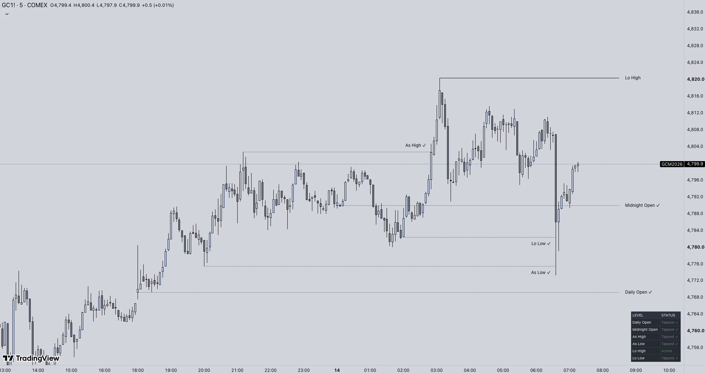

# Key Opens

TradingView overlay for **Powell's key opens** and the **10am model** he teaches and trades — session opens, opening gaps, and session highs/lows. Built for index futures (NQ, MNQ, ES, MES) with **1-minute accurate** timestamps even on higher timeframes.

All times are **America/New_York**.

This repo is the **source code**. To put it on a chart, add the published indicator — you do not need to paste Pine yourself:

**[Key Opens on TradingView](https://www.tradingview.com/script/b9dUOCXq-Key-Opens-nqjack/)**

Tinker with [`key_opens.pine`](key_opens.pine) here if you want to change the script.

## Features

- **Key opens** — 18:00 daily, True Asia, 22:00, midnight, True London, London, True NY, pre-market, NY open, 10am, plus three custom H:M opens
- **Weekly / monthly** — weekly, true weekly (09:30), monthly, true monthly
- **Prior range** — PDH/PDL, PWH/PWL, ATH
- **Session H/L** — Asia, London, NY AM, NY PM, with optional freeze when the next session takes them out
- **NDOG & NWOG** — extending gap boxes/lines with top, mid (CE), and bottom
- **Powell 10am model** — the 10:00 NY key open Powell trades (4-hour candle open), plus a short volume-imbalance box and optional NQ vs MNQ 10:00 lines
- **Tap detection** — 1-minute engine marks levels tested after a candle/time delay; optional hide-when-tapped and per-category line styles
- **Info panel** — live prices, active vs tapped, tap time; optional checklist

## Install

**Use it on a chart:** add [Key Opens](https://www.tradingview.com/script/b9dUOCXq-Key-Opens-nqjack/) from TradingView indicators (author **nqjack**). That is the supported copy.

**This GitHub repo** is source only. Fork or copy [`key_opens.pine`](key_opens.pine) into the Pine Editor if you want to edit it.

Works on any timeframe. On charts above 1 minute, opens and taps are still taken from 1-minute data.

## Powell 10am model

This is the **10am key open** from Powell Trades — 10:00 NY, the open of the 4-hour candle. NQ/MNQ often gap versus the 9:59 close (volume imbalance), and the two contracts can print different opens.

| Setting | What it does |
|---|---|
| **10:00** | This chart’s 10:00 open line |
| **Imbalance** | Small box between 9:59 close and 10:00 open. Width in bars, min gap in ticks, bull/bear fill |
| **NQ 10am / MNQ 10am** | Extra lines for each contract. Empty symbol fields auto-pair `NQ` ↔ `MNQ` on the same feed |
| **Only show if they differ** | Hide the extra lines unless \|NQ − MNQ\| ≥ the tick threshold |

The imbalance box stays put (it does not grow with price). Old days’ boxes remain; the 10am *lines* reset at the session start (default 18:00).

## Settings cheat sheet

- **Line styles by category** — solid / dashed / dotted, plus a separate style after a tap
- **Overlap stagger** — pushes stacked labels apart so they stay readable
- **New day starts at** — default 18:00 (futures session)

## Disclaimer

Educational charting tool. Not financial advice. Futures and CFDs carry risk of loss.

## License

[MIT](LICENSE)
